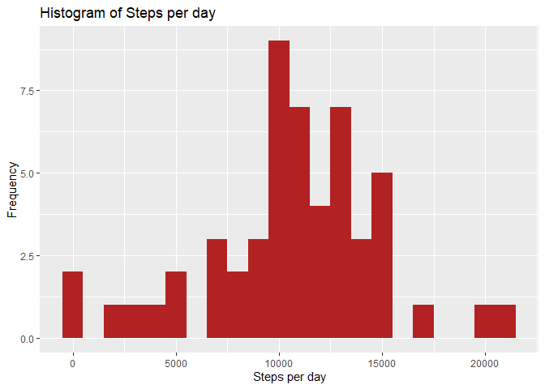
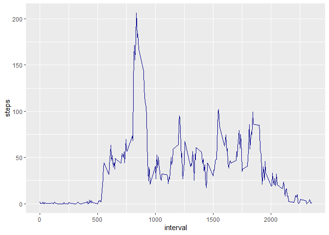
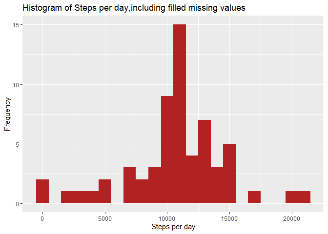
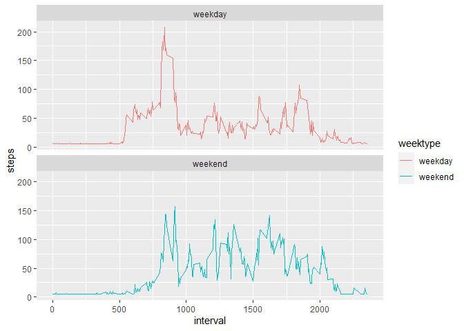

## Loading and preprocessing the data

##### 1. Load the data (i.e. read.csv())

```r
if(!file.exists('activity.csv')){
    unzip('activity.zip')
}
data <- read.csv("activity.csv")
```
##### 2. Process/transform the data (if necessary) into a format suitable for your analysis

```r
data$date <- as.Date(data$date)
```

-----

## What is mean total number of steps taken per day?

```r
steps <- data %>%
  filter(!is.na(steps)) %>%
  group_by(date) %>%
  summarize(steps = sum(steps)) %>%
  print
```

```
## # A tibble: 53 x 2
##    date       steps
##  * <date>     <int>
##  1 2012-10-02   126
##  2 2012-10-03 11352
##  3 2012-10-04 12116
##  4 2012-10-05 13294
##  5 2012-10-06 15420
##  6 2012-10-07 11015
##  7 2012-10-09 12811
##  8 2012-10-10  9900
##  9 2012-10-11 10304
## 10 2012-10-12 17382
## # ... with 43 more rows
```

##### 1. Make a histogram of the total number of steps taken each day

```r
ggplot(steps, aes(x = steps)) +
  geom_histogram(fill = "firebrick", binwidth = 1000) +
  labs(title = "Histogram of Steps per day", x = "Steps per day", y = "Frequency")
```

<!-- -->

##### 2. Calculate and report the mean and median total number of steps taken per day

```r
stepsPerDayMean <- mean(steps$steps)
stepsPerDayMedian <- median(steps$steps)
```
* Mean: 1.0766189\times 10^{4}
* Median:  10765

-----

## What is the average daily activity pattern?

```r
interval <- data %>%
  filter(!is.na(steps)) %>%
  group_by(interval) %>%
  summarize(steps = mean(steps))
```

##### 1. Make a time series plot

```r
ggplot(interval, aes(x=interval, y=steps)) +
  geom_line(color = "dark blue")
```

<!-- -->

##### 2. Which 5-minute interval, on average across all the days in the dataset, contains the maximum number of steps?

```r
interval[which.max(interval$steps),]
```

```
## # A tibble: 1 x 2
##   interval steps
##      <int> <dbl>
## 1      835  206.
```


----

## Imputing missing values
##### 1. Calculate and report the total number of missing values in the dataset 

```r
numMissingValues <- length(which(is.na(data$steps)))
```

* Number of missing values: 2304

##### 2. Devise a strategy for filling in all of the missing values in the dataset.
##### 3. Create a new dataset that is equal to the original dataset but with the missing data filled in.

```r
new_data <-  data
new_data$steps <- impute(new_data$steps,fun=mean)
```


##### 4. Make a histogram of the total number of steps taken each day 

```r
steps_new <- new_data %>%
  filter(!is.na(steps)) %>%
  group_by(date) %>%
  summarise(steps=sum(steps)) %>%
  print
```

```
## # A tibble: 61 x 2
##    date        steps
##  * <date>      <dbl>
##  1 2012-10-01 10766.
##  2 2012-10-02   126 
##  3 2012-10-03 11352 
##  4 2012-10-04 12116 
##  5 2012-10-05 13294 
##  6 2012-10-06 15420 
##  7 2012-10-07 11015 
##  8 2012-10-08 10766.
##  9 2012-10-09 12811 
## 10 2012-10-10  9900 
## # ... with 51 more rows
```

```r
ggplot(steps_new, aes(x = steps)) +
       geom_histogram(fill = "firebrick", binwidth = 1000) +
       labs(title = "Histogram of Steps per day,including filled missing values", x = "Steps per day", y = "Frequency")
```

<!-- -->

##### ... and Calculate and report the mean and median total number of steps taken per day. 

```r
mean_steps_new <- mean(steps_new$steps)
median_steps_new <- median(steps_new$steps)
```
* Mean (Imputed): 1.0766189\times 10^{4}
* Median (Imputed):  1.0766189\times 10^{4}


----

## Are there differences in activity patterns between weekdays and weekends?
##### 1. Create a new factor variable in the dataset with two levels – “weekday” and “weekend” indicating whether a given date is a weekday or weekend day.


```r
new_data$weektype <- ifelse(as.POSIXlt(new_data$date)$wday %in% c(0,6),"weekend","weekday")
```

##### 2. Make a panel plot containing a time series plot


```r
interval_full <- new_data %>%
       group_by(interval, weektype) %>%
       summarise(steps = mean(steps))
```

```
## `summarise()` has grouped output by 'interval'. You can override using the `.groups` argument.
```

```r
s <- ggplot(interval_full, aes(x=interval, y=steps, color = weektype)) +
  geom_line() +
  facet_wrap(~weektype, ncol = 1, nrow=2)
print(s)
```

<!-- -->


